# Remaining collection readability review

The owner approved correcting the remaining ten models after the first four-model
readability pass. This increment changes drawer-stack, padlock, gear-train,
wave-field, bar-city, bridge, wind-turbine, pendulum, envelope, and empty-box.
The collection remains fourteen original figures across eight categories.

## Matched 240 px comparisons

Both columns share the same viewport, stroke, white background, default intensity
0.5, and resting pose. Before triplets are preserved from main ccc03fc. After
triplets match the thirty intentional regression updates byte-for-byte. The
previous four-model correction and its twelve references remain unchanged. TEST-03.

| Figure | Before | After |
| --- | --- | --- |
| drawer-stack | 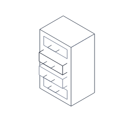 | 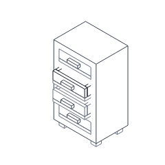 |
| padlock | 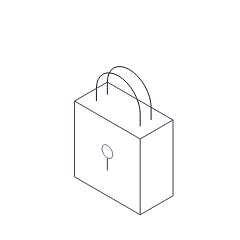 | 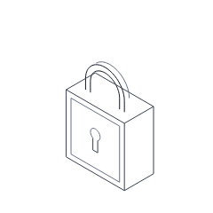 |
| gear-train | 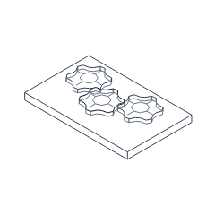 | 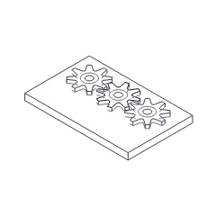 |
| wave-field | 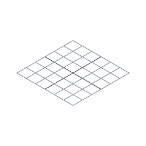 | 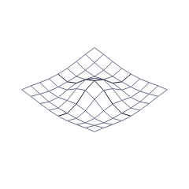 |
| bar-city | 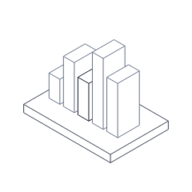 | 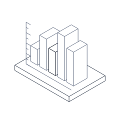 |
| bridge | 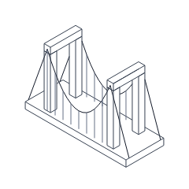 | 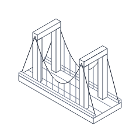 |
| wind-turbine | 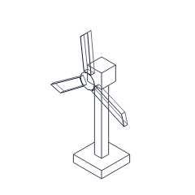 | 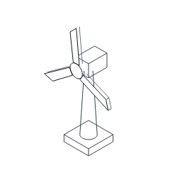 |
| pendulum | 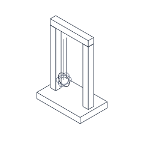 | 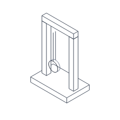 |
| envelope | 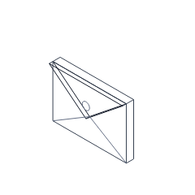 | 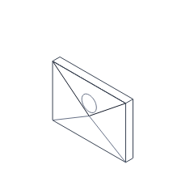 |
| empty-box | 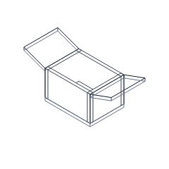 | 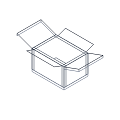 |

| Figure | Before full / reduced | After full / reduced |
| --- | --- | --- |
| drawer-stack | [Full](visual-changes/collection-readability/before/drawer-stack-full.png) / [Reduced](visual-changes/collection-readability/before/drawer-stack-reduced.png) | [Full](visual-changes/collection-readability/after/drawer-stack-full.png) / [Reduced](visual-changes/collection-readability/after/drawer-stack-reduced.png) |
| padlock | [Full](visual-changes/collection-readability/before/padlock-full.png) / [Reduced](visual-changes/collection-readability/before/padlock-reduced.png) | [Full](visual-changes/collection-readability/after/padlock-full.png) / [Reduced](visual-changes/collection-readability/after/padlock-reduced.png) |
| gear-train | [Full](visual-changes/collection-readability/before/gear-train-full.png) / [Reduced](visual-changes/collection-readability/before/gear-train-reduced.png) | [Full](visual-changes/collection-readability/after/gear-train-full.png) / [Reduced](visual-changes/collection-readability/after/gear-train-reduced.png) |
| wave-field | [Full](visual-changes/collection-readability/before/wave-field-full.png) / [Reduced](visual-changes/collection-readability/before/wave-field-reduced.png) | [Full](visual-changes/collection-readability/after/wave-field-full.png) / [Reduced](visual-changes/collection-readability/after/wave-field-reduced.png) |
| bar-city | [Full](visual-changes/collection-readability/before/bar-city-full.png) / [Reduced](visual-changes/collection-readability/before/bar-city-reduced.png) | [Full](visual-changes/collection-readability/after/bar-city-full.png) / [Reduced](visual-changes/collection-readability/after/bar-city-reduced.png) |
| bridge | [Full](visual-changes/collection-readability/before/bridge-full.png) / [Reduced](visual-changes/collection-readability/before/bridge-reduced.png) | [Full](visual-changes/collection-readability/after/bridge-full.png) / [Reduced](visual-changes/collection-readability/after/bridge-reduced.png) |
| wind-turbine | [Full](visual-changes/collection-readability/before/wind-turbine-full.png) / [Reduced](visual-changes/collection-readability/before/wind-turbine-reduced.png) | [Full](visual-changes/collection-readability/after/wind-turbine-full.png) / [Reduced](visual-changes/collection-readability/after/wind-turbine-reduced.png) |
| pendulum | [Full](visual-changes/collection-readability/before/pendulum-full.png) / [Reduced](visual-changes/collection-readability/before/pendulum-reduced.png) | [Full](visual-changes/collection-readability/after/pendulum-full.png) / [Reduced](visual-changes/collection-readability/after/pendulum-reduced.png) |
| envelope | [Full](visual-changes/collection-readability/before/envelope-full.png) / [Reduced](visual-changes/collection-readability/before/envelope-reduced.png) | [Full](visual-changes/collection-readability/after/envelope-full.png) / [Reduced](visual-changes/collection-readability/after/envelope-reduced.png) |
| empty-box | [Full](visual-changes/collection-readability/before/empty-box-full.png) / [Reduced](visual-changes/collection-readability/after/empty-box-reduced.png) | [Full](visual-changes/collection-readability/after/empty-box-full.png) / [Reduced](visual-changes/collection-readability/after/empty-box-reduced.png) |

## Drawing changes

- Drawer: four hollow trays have a floor and opaque walls. Their openings remain
  visible when pulled out; solid handles and feet replace thin floating hardware.
- Lock: inner/outer U contours explain shackle thickness, a partial rear contour
  explains depth, and a connected keyhole outline replaces the circle and stick.
- Gears: eight deeper teeth, aligned centers, opposing rotation phases, and hub
  rings replace overlapping six-tooth shapes and spokes. Covered lower contours
  are omitted. This is a non-intersecting stylized profile, not an involute simulation.
- Wave: a quiet resting crest and trough give meaning without input. A 9-by-9
  mesh samples the surface more smoothly; pointer input adds a bounded local crest.
- Chart: unlabeled scale ticks and a baseline distinguish data columns from buildings.
- Bridge: curbs and road-edge lines define the deck; smoother cables have symmetric
  hanger spacing without a duplicate hanger inside the left tower.
- Turbine: a tapered mast, longer nacelle, exposed blade side contours, and opaque
  hub/blade clipping replace transparent rotor overlap. Figure-local interval
  clipping hides covered body edges in every sampled rotor pose.
- Pendulum: a solid disk outline and exposed rear arc replace three intersecting
  great circles. The two rod contours stop at the weight's upper attachment.
- Envelope: one attached flap triangle and a larger seal replace doubled flap
  wireframes. The letter retains its blank ruled-line and stamp-area geometry.
- Carton: exposed underside edges replace complete rear flap wireframes; two short
  end flaps complete the four-flap carton silhouette.

Inspection opened every before resting image, every revised rest/full image at
240 px and default intensity, and every full-response image at intensity 1. All
ten reduced-motion images are byte-identical to their revised resting images.
Look checks also exercise intensity 0, 0.5, and 1. Gallery screenshots were reviewed
alongside the individual illustrations. These observations identify specific
improvements; they do not prove commercial usability or independent human blind
recognition. VIS-08 and the formal flashing audit remain pending. No additional
recognition question is sent to the owner, following the established preference.

Keep the original projection, shared stroke, unit-based fixed dimensions, four
tones, and existing accent policy. Curved/rotated coordinates are derived from
these dimensions. All working numeric storage and styles are initialized once;
builds allocate no arrays, objects, or closures. No core/API/dependency, catalog
membership, gallery interface, or primary interaction mapping changes are included.

## Measurements and verification

| Figure | Before / after gzip bytes | Change | Before / after rest segments | Minimum look padding |
| --- | ---: | ---: | ---: | ---: |
| drawer-stack | 551 / 612 | +11.1% | 72 / 348 | 11.11% |
| padlock | 698 / 760 | +8.9% | 64 / 109 | 10.53% |
| gear-train | 774 / 776 | +0.3% | 210 / 297 | 10.84% |
| wave-field | 617 / 670 | +8.6% | 84 / 144 | 11.51% |
| bar-city | 558 / 633 | +13.4% | 72 / 83 | 10.87% |
| bridge | 665 / 702 | +5.6% | 136 / 176 | 11.54% |
| wind-turbine | 743 / 1,606 | +116.2% | 84 / 75 | 8.33% |
| pendulum | 671 / 749 | +11.6% | 98 / 100 | 10.87% |
| envelope | 816 / 771 | -5.5% | 60 / 70 | 16.30% |
| empty-box | 668 / 767 | +14.8% | 84 / 84 | 11.65% |

PERF-06: increases above 5% pay for the hollow drawer trays, physical shackle/keyhole,
sampled resting wave, chart scale, bridge curbs/cable sampling, solid weight, and
complete carton silhouette. The largest cost is turbine occlusion: three convex
blade faces and the hub mask body and rear-blade edges with reusable interval
storage. That corrects a visible overlap defect while reducing resting segments.
All figures remain below 2,048 gzip bytes; unchanged core is exactly 6,144 bytes.
The drawer emits 348 segments, within the existing 400-segment SVG threshold;
its extra opaque walls are a measured quality cost rather than an optimization.

Three reproducing geometry checks fail on ccc03fc and pass after correction:
gear-contour intersections across 101 input poses, covered turbine hub edges,
and body contours passing through turbine blades across 21 poses. TEST-02.
The full suite has seventy passing unit tests and 99.62% core line coverage.
Eighteen browser cases cover interaction, keyboard, cleanup, examples, and 42
references. All fourteen gallery examples execute and responsive/control checks
pass at 320/390/768/1440 px. Strict types, lint, builds, and distribution limits pass.
Padding is checked across the full input envelope, not only the look samples.
Hi/edge contrast remains 10.3:1 on white.

See [raw runtime measurements](review/collection-readability/performance.json).
Windows Chromium 153, CPU 4x, twenty instances cycling the same fourteen-definition
order: p95 6.2 ms, maximum 9.4 ms, first draw 16.1 ms, 72 samples, and zero
idle/offscreen callbacks. Both original targets (4 ms/frame and 16 ms first draw)
remain exceeded. Compared with the previous historical sample, p95 increases
24.0% (5.0 to 6.2 ms), maximum increases 84.3% (5.1 to 9.4 ms), and first draw
decreases 4.7% (16.9 to 16.1 ms). The cohort and harness are unchanged; samples
come from different sessions and do not isolate causality. Additional drawer
walls, surface sampling, and rotor clipping are the explicit quality tradeoff
justifying this measured frame regression. PERF-06. CI records its own samples.
Retain the owner-authorized timing-only exception; size and idle/offscreen budgets
remain mandatory, and passing an advisory duration gate is not budget compliance.

Relevant review rules: GEN-01–05, CODE-01–08, API-02/03/06, VIS-01–09, MOT-01–06,
FIG-01–06, PERF-01–06, A11Y-01–05, TEST-01–04, GIT-01–06, DEP-01–04, DOC-01.
