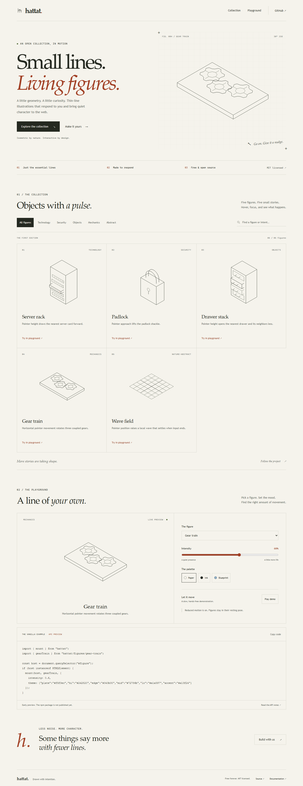
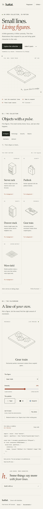

# Gallery UI review

This is the first user-facing website. Existing figure geometry and the fifteen figure
regression references are unchanged. The site uses an original paper-and-ink layout,
serif headings, a subtle construction grid, local fonts, and real interactive SVG figures.

| Desktop, 1440 px | Mobile, 390 px |
| --- | --- |
|  |  |

The images show reduced motion so the figures remain in their resting poses. Normal motion
responds to the pointer and arrow keys; autoplay is opt-in. Agent visual inspection covered
both layouts and the Ink palette. This is UI review, not an independent figure blind test.

`pnpm test:docs` verifies the actual built site under the GitHub project subpath, all five
copied examples, search by intent, category filtering, figure selection, palette and intensity
updates, autoplay controls, clipboard feedback, reduced motion, and no horizontal overflow at
320, 390, 768, and 1440 px. Screenshots and raw test failures are uploaded as CI evidence.

See [hosting and local preview notes](../apps/docs/README.md).
