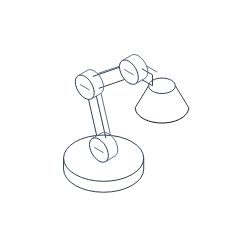
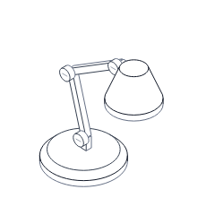
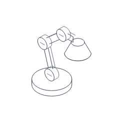
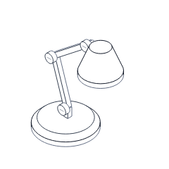

# Desk lamp quality pilot

The owner approved rebuilding one figure before expanding the collection. This
pilot replaces the desk lamp's variable-length arm, large pivot drums, and bare
shade with a coherent solid assembly. The other thirteen figures remain unchanged.
This is an agent visual review, not independent human or commercial acceptance.

## Matched comparisons

Both columns use 240 px, the default intensity 0.5, the same white background,
shared stroke, and input. Before references come from main e16aefe. After references
match the three intentional regression updates. TEST-03.

| Pose | Before | After |
| --- | --- | --- |
| Rest |  |  |
| Full response |  |  |
| Reduced motion |  |  |

## Geometry and motion

- The base retains a 1.5-unit radius and 0.5-unit height. Its upper 0.25-unit bevel
  meets a 1.25-unit-radius top surface. A short stem physically connects the pivot.
- The two arms have fixed 2.5/2.75-unit lengths and 0.25-by-0.25-unit sections.
  Three 0.25-radius, 0.25-deep pivots replace the disproportionate drums. Each
  visible front pivot has one quiet screw slot.
- A 0.75-unit connector meets the shade. Its tapered shell is 1.25 units high,
  widening from radius 0.5 to 1, with a separate 0.25-unit lower lip. No inner
  wireframe, springs, vents, logos, or texture are added.
- Camera-facing surfaces of the arms, pivots, base, and shade mask complete hidden
  line intervals. Both-visible-endpoint crossings are handled. Shared rings at
  the bevel and lip are drawn once. Base curves use 48 samples after inspecting
  faceting at 480 px; the shade uses 32 and small pivots use 24.
- Four shared tones distinguish the shade silhouette, structural edges, joints,
  and secondary details. Stroke remains a theme token; no accent, gradients,
  shadows, or decorative fills are used. All fixed dimensions are unit multiples.
- With `d=(2*aim-1)*intensity`, the world-space arm angles are `108-6*d` and
  `38-14*d` degrees. The approved sketch used plus signs; subtracting them makes
  increasing pointer x move the head right instead of left. Lengths stay constant.
  Existing input, default intensity, keyboard behavior, and spring preset remain.
- Square projected bounds are fixed across all poses. Numerical scratch storage
  is initialized once and reused; no arrays, objects, or closures are created in
  build. Fixed numeric scratch storage is 54,464 bytes per loaded lamp module,
  shared across instances. The SVG string boundary retains the existing engine behavior.
  A projected face-bounds filter was added after measuring the new masking cost;
  it skips disjoint faces without changing the visibility calculation.

All geometry and masking are original, authored from the approved physical brief.
No other library's implementation, figure design, or assets were imported. Core,
API, dependencies, and collection membership remain unchanged. GEN-02, CODE-03–05.

## Visual evidence and acceptance limits

Open the matched images and the pose strips at actual size:

- [240 px light](review/lamp-quality/poses-240-light.png) /
  [240 px dark](review/lamp-quality/poses-240-dark.png).
- [480 px light](review/lamp-quality/poses-480-light.png) /
  [480 px dark](review/lamp-quality/poses-480-dark.png).

Each strip shows maximum-intensity left, rest, and right poses. The look command
also captures rest/full/reduced motion at intensity 0, 0.5, and 1. Inspection checks
connections, thickness, silhouettes, hidden lines, curve continuity, and padding.
Technical results do not measure taste. Human blind recognition and the formal
flashing audit remain pending; the owner is not asked another recognition question.
The next collection-wide redesign requires evaluating this pilot first. VIS-08.

## Verification and budgets

The physical-length regression derives pivot centers from emitted circular arcs,
without copying the build's kinematic formulas. It fails on e16aefe: the upper arm
changes from its resting length 2.657536 to 2.298097 units. The replacement keeps
both lengths constant across 101 poses at each of three intensities. Independent
ray checks verify all opaque pivot faces and the shade shell over 101 poses.
Direction and intensity-zero checks complete the four dedicated tests. The old
single-rest pivot test is replaced by coverage of all three pivots across motion.

Runtime measurements are recorded in
[paired performance JSON](review/lamp-quality/paired-performance.json). Both versions
use one Chromium process, sequential fresh pages, 4x CPU throttling, and the same
20-instance fixture. A second cohort contains twenty lamps. The baseline packaged
entry is captured before rebuilding; rest segment counts assert that different
versions were measured. No diagnostic profiler or screenshots run during timing.
Warm-up/order and machine load can affect results; one pair does not establish
a general performance improvement.

| Metric | Before | After |
| --- | ---: | ---: |
| Lamp entry gzip, excluding core | 1,368 bytes | 1,880 bytes |
| Rest segments | 247 | 312 |
| Mixed cohort p95 / maximum frame | 7.8 / 11.3 ms | 11.0 / 13.1 ms |
| Mixed cohort maximum first draw | 17.3 ms | 11.4 ms |
| Twenty lamps p95 / maximum frame | 4.5 / 5.9 ms | 7.2 / 9.3 ms |
| Twenty lamps maximum first draw | 7.6 ms | 17.3 ms |
| Idle / offscreen callbacks, both cohorts | 0 / 0 | 0 / 0 |

Core stays at 6,144 gzip bytes. The lamp remains below 2,048 bytes, with 13.21%
minimum sampled padding; all sampled poses stay below 400 segments. PERF-06:
entry size rises 37.4% and rest segments rise 26.3%. Solid masking of all components,
fixed-length geometry, the bevel/lip, and smoother base curves explain the cost.
The mixed cohort p95 increases 41.0% and its maximum increases 15.9%. Twenty lamps
show a 60.0% p95 increase and a 127.6% first-draw increase in this pair. The projected
face-bounds filter limits the masking work, but the change is not presented as a
performance improvement. Both cohorts exceed the 4 ms maximum frame target; twenty
lamps also exceed the 16 ms first-draw target. The existing timing-only PERF-01–05
exception remains in force; size and idle/offscreen budgets remain mandatory.

Required checks: formatting, strict types, workspace/distribution builds, repository
rules, unit coverage, browser/visual checks, and every executable gallery example.
Local results: `pnpm check` passes; 73 unit tests pass with 99.62% core line coverage;
all eighteen browser cases and 42 references pass. All fourteen executable gallery
examples pass with search, filters, themes, reduced motion, and responsive controls.
Only the lamp's three references change. No CLI, skill, catalog schema, public API,
or later-phase agent work is introduced; agent evals remain pending in Phase 2.

Review rules: GEN-01–05, CODE-01–08, API-02/06, VIS-01–09, MOT-01–06, FIG-01–06,
PERF-01–06, A11Y-01–05, TEST-01–04, GIT-01–06, DEP-01–04, DOC-01.
