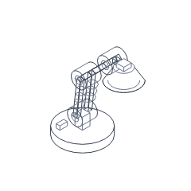
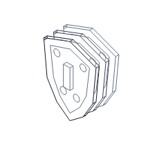
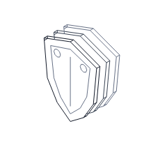
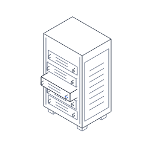

# Figure readability correction

This page records the first four-model correction. The owner then authorized
the [remaining ten-model review](collection-readability-review.md), which completes
this round of drawing corrections without claiming independent visual acceptance.

The owner rejected the physical-detail pass on 2026-10-07: the models still looked
like scribbles. Passing automated checks and inspecting images did not establish
usable visual quality. This correction prioritizes coherent silhouettes and solid
relationships at 240 px over hardware density. The collection remains fourteen
figures; further additions remain secondary to visual quality.

## Matched before and after

Both columns use the same 240 px viewport, default intensity 0.5, white background,
shared stroke, and pose. Before images are preserved from main at 7ed9a15. After
images match the twelve intentionally changed regression references. The other
thirty regression images are unchanged. TEST-03.

| Figure | Before rest | After rest |
| --- | --- | --- |
| desk-lamp |  |  |
| db-stack |  |  |
| shield-layers |  |  |
| server-rack |  |  |

| Figure | Before full / reduced | After full / reduced |
| --- | --- | --- |
| desk-lamp | [Full](visual-changes/readability/before/desk-lamp-full.png) / [Reduced](visual-changes/readability/before/desk-lamp-reduced.png) | [Full](visual-changes/readability/after/desk-lamp-full.png) / [Reduced](visual-changes/readability/after/desk-lamp-reduced.png) |
| db-stack | [Full](visual-changes/readability/before/db-stack-full.png) / [Reduced](visual-changes/readability/before/db-stack-reduced.png) | [Full](visual-changes/readability/after/db-stack-full.png) / [Reduced](visual-changes/readability/after/db-stack-reduced.png) |
| shield-layers | [Full](visual-changes/readability/before/shield-layers-full.png) / [Reduced](visual-changes/readability/before/shield-layers-reduced.png) | [Full](visual-changes/readability/after/shield-layers-full.png) / [Reduced](visual-changes/readability/after/shield-layers-reduced.png) |
| server-rack | [Full](visual-changes/readability/before/server-rack-full.png) / [Reduced](visual-changes/readability/before/server-rack-reduced.png) | [Full](visual-changes/readability/after/server-rack-full.png) / [Reduced](visual-changes/readability/after/server-rack-reduced.png) |

## Changes and visual review

- Lamp: one thick articulated arm replaces duplicate wireframes and overlapping
  counterbalance coils. The pedestal, switch, inner pivot rings, and shade lip
  are removed. Front beam contours and one exposed side explain thickness; opaque
  pivot drums clip covered arm and rear-ring edges along the camera direction.
  A wider shade and separated joints improve the silhouette.
- Database: retain the outer cylinder contours and the uppermost inset rim. Remove
  repeated inset rims and lower seams, and use one front control per layer.
- Shield: only the foremost face has an inset border and two fasteners. Rear layers
  carry structural contours. A central surface line replaces the raised block.
- Rack: replace the tiny face openings with two spaced ventilation lines per card;
  remove large side fastener rings. Keep pull handles, panel, rails, and feet.

Agent inspection opened all four rest/full/reduced images at default intensity,
and all four full-response images at intensity 1. The look checker exercised
intensities 0, 0.5, and 1; the unit suite samples the entire input envelope. The
lamp's pivot overlap is visibly reduced, and the other three faces have less
crowding. These are original isometric line illustrations, not photographic
renders. This review does not establish commercial usability, independent human
blind recognition, or a completed flashing audit. The remaining ten models have
not received this correction. VIS-08 remains pending; automated success must not
be described as visual-quality acceptance.

No core, public API, metadata, interaction mapping, runtime dependency, stroke,
gradient, shadow, or accent changes are introduced. Fixed sizes use unit multiples;
rotated coordinates are derived continuously. Numeric buffers and styles are
allocated at module initialization, with no new frame allocations. GEN-02,
CODE-03–05, API-06, VIS-01–05/09.

## Verification and budgets

| Figure | Before gzip | After gzip | Change | Before / after rest segments | Minimum sampled padding |
| --- | ---: | ---: | ---: | ---: | ---: |
| desk-lamp | 1,261 | 1,368 | +8.5% | 345 / 247 | 18.13% |
| db-stack | 1,078 | 1,079 | +0.1% | 270 / 166 | 9.29% |
| shield-layers | 1,062 | 1,036 | -2.4% | 134 / 83 | 9.09% |
| server-rack | 892 | 766 | -14.1% | 281 / 179 | 9.62% |

PERF-06: the lamp's size increase pays for clipping covered edges at the pivot
drums, including arm contours whose two ends are hidden while their middle is
visible. It corrects a visible defect while reducing emitted rest segments 28.4%.
Every entry remains below 2,048 gzip bytes; core remains exactly 6,144 bytes.
All sampled poses retain at least 8% padding and 60–400 segments.

The new head-pivot overlap regression fails on 7ed9a15 with seven covered segment
midpoints and passes after this correction with zero. This verifies an occlusion
defect, not subjective attractiveness. TEST-02.

Required checks: formatting, strict types, build, bootstrap rules, 67 unit tests
with 99.62% core line coverage, eighteen browser cases, all fourteen executable
gallery examples, and responsive gallery controls. Contrast remains 10.3:1 on
white for hi/edge. Twelve reference updates have matched before/after evidence.
Raw runtime measurements are recorded in [performance evidence](review/readability/performance.json).
Windows Chromium 153 at 4x CPU, twenty instances cycling the same fourteen-figure
order: p95 5.0 ms, maximum 5.1 ms, first draw 16.9 ms, 73 samples, and zero
idle/offscreen callbacks. Both the 4 ms/frame and 16 ms first-draw targets remain
exceeded. The previous historical sample was p95 7.5 ms, maximum 8.6 ms, first
draw 18.6 ms. The cohort and harness are unchanged, but these different-session
samples are not an isolated causal benchmark. PERF-06.
The existing timing-only owner exception remains in effect; frame/first-draw
duration warnings do not excuse bundle-size or idle/offscreen failures.

Relevant review rules: GEN-01–05, CODE-01–08, API-02/03/06, VIS-01–09, MOT-01–06,
FIG-01–06, PERF-01–06, A11Y-01–05, TEST-01–04, GIT-01–06, DEP-01–04, DOC-01.
