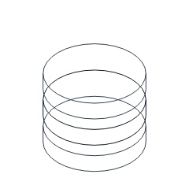
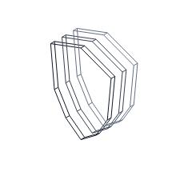
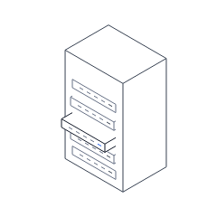
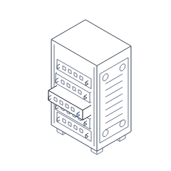
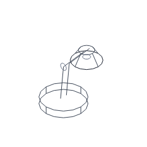

# Physical detail and solid geometry review

The owner requested less basic, more convincing models on 2026-10-07. Inspecting
the existing 240 px images exposed transparent overlaps, empty cabinet surfaces,
and lamp arms represented by isolated lines. Improve four models before continuing
the 32-figure expansion. The collection remains fourteen original figures across
eight categories; this is a visual-quality increment, not four additional entries.

## Before and after

All images below use the same 240 px viewport, shared stroke, white background,
and default intensity 0.5. Before triplets are preserved from main at 769bf77;
after triplets match the intentional regression references in this PR. Inspect
resting silhouettes and physical relationships as well as the input response.

| Figure | Before rest | After rest |
| --- | --- | --- |
| db-stack |  |  |
| shield-layers |  |  |
| server-rack |  |  |
| desk-lamp |  |  |

| Figure | Before full / reduced | After full / reduced |
| --- | --- | --- |
| db-stack | [Full](visual-changes/realism/before/db-stack-full.png) / [Reduced](visual-changes/realism/before/db-stack-reduced.png) | [Full](visual-changes/realism/after/db-stack-full.png) / [Reduced](visual-changes/realism/after/db-stack-reduced.png) |
| shield-layers | [Full](visual-changes/realism/before/shield-layers-full.png) / [Reduced](visual-changes/realism/before/shield-layers-reduced.png) | [Full](visual-changes/realism/after/shield-layers-full.png) / [Reduced](visual-changes/realism/after/shield-layers-reduced.png) |
| server-rack | [Full](visual-changes/realism/before/server-rack-full.png) / [Reduced](visual-changes/realism/before/server-rack-reduced.png) | [Full](visual-changes/realism/after/server-rack-full.png) / [Reduced](visual-changes/realism/after/server-rack-reduced.png) |
| desk-lamp | [Full](visual-changes/realism/before/desk-lamp-full.png) / [Reduced](visual-changes/realism/before/desk-lamp-reduced.png) | [Full](visual-changes/realism/after/desk-lamp-full.png) / [Reduced](visual-changes/realism/after/desk-lamp-reduced.png) |

## Physical changes

- Database: closed cylindrical layers hide covered rear rims; top rims, lower seams,
  and front controls explain how the layers are constructed. Layers remain ordered
  as the selected gap opens. Ray tests use the same (1, 1, 1) camera direction as
  the isometric projection and clip crossing contour intervals numerically.
- Shield: nearer faces cover deeper contours; an inset panel border, four fasteners
  per face, and a raised front reinforcement give thickness and construction cues.
  Convex face tests also hide the layer's covered back edges.
- Rack: thicker server faces have openings and projecting pull handles. A removable
  side panel has ventilation and four fasteners; mounting rails and feet make the
  enclosure read as installed equipment. Existing background-colored plates handle
  occlusion between the cabinet, cards, and feet.
- Lamp: rectangular arm members, three connected pivot assemblies, counterbalance
  coils, a switch, shade mount, and a double lower lip replace bare lines and an
  overlapping wire shade. Rear lower shade/base contours are omitted where covered.

Keep original geometry, shared stroke, isometric projection, unit-aligned physical
dimensions, and existing tones. Fixed widths/radii use whole or half multiples of
the unit; angles and coordinates derived from rotations are continuous. There are
no gradients, shadows, textures, logos, decorative text, or new accent elements.
Opaque plates remain background-colored occlusion surfaces. Numerical storage is
allocated at module setup; builds introduce no frame objects, arrays, or closures.
The core, public options, names, labels, and primary input mappings are unchanged.

These are informed agent visual reviews of line illustrations. They do not establish
photographic realism, an independent human blind-recognition result, or a formal
flashing audit. The remaining ten models have not received this physical-detail pass.

## Budgets and evidence

| Figure | Before gzip | After gzip | Increase | Rest segments | Minimum sampled padding |
| --- | ---: | ---: | ---: | ---: | ---: |
| db-stack | 641 | 1,078 | 68.2% | 270 | 9.29% |
| shield-layers | 569 | 1,062 | 86.6% | 134 | 9.09% |
| server-rack | 587 | 892 | 52.0% | 281 | 9.62% |
| desk-lamp | 714 | 1,261 | 76.6% | 345 | 18.13% |

PERF-06: each increase above 5% is justified by the owner's quality request and the
construction/occlusion changes above. Every entry remains below 2,048 gzip bytes;
core is still exactly 6,144. Occluded contour emission can change the database and
shield segment totals by pose, but every sampled pose stays between 60 and 400.
Keep SVG; this change adds no renderer or runtime dependency. Look inspected all
four at intensity 0, 0.5, and 1, without overflow, and measured hi/edge contrast of
10.3:1 on white. The original timing-only owner exception remains in effect; the
4 ms/frame and 16 ms first-draw targets remain visible warnings when exceeded.

The new database regression checks that covered lower rear-rim pieces are not drawn
through closed upper layers. Twelve intentional reference changes have before/after
evidence; the other thirty images are preserved. Verification: 66 unit tests pass with 99.62% core line coverage, eighteen browser
cases pass, and all fourteen gallery examples and responsive/control checks pass.
The new occlusion test fails on the original 769bf77 database geometry and passes
on the corrected build. Required strict checks and distribution limits pass.

Relevant review rules: GEN-01–05, CODE-03–08, API-02/03/06, VIS-01–09, MOT-01–06,
FIG-01–06, PERF-01–06, A11Y-01–05, TEST-01–04, GIT-01–06, DEP-01–04, DOC-01.

The local Windows Chromium 153 run at 4x CPU records twenty instances cycling the
same fourteen-definition order: p95 7.5 ms, maximum 8.6 ms, first draw 18.6 ms,
73 samples, and zero idle/offscreen callbacks. See [raw measurements](review/realism/performance.json).
Compared with the previous historical sample, maximum frame increases 38.7%
(6.2 to 8.6 ms) and first draw 43.1% (13.0 to 18.6 ms). Cohort membership and the
benchmark are unchanged, but the samples were collected in different sessions;
this is not an isolated causal comparison. Added mechanical detail and figure-local
occlusion justify the increase for this owner-requested quality pass. Both timing
targets are exceeded; the gate passes only under the existing timing-only exception.
CI records independent platform samples. PERF-06.
