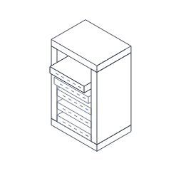
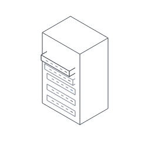
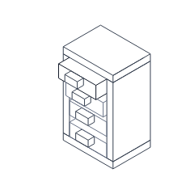
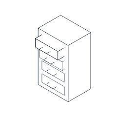
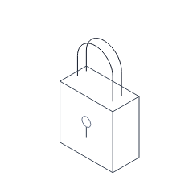
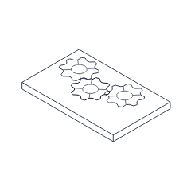
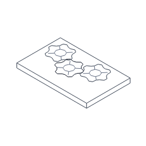
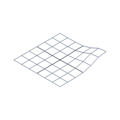

# Intentional Phase 1 simplification

Initial 240 px references are generated from source through `look`. They are then verified
against bundled public imports with Playwright; CI never regenerates references automatically.
The fixture uses a fixed clock, light background, 1× DPR, and intensity 0.5.

To reduce the measured renderer cost, replace multi-part rack/cabinet shells with one solid
occluding shell, replace drawer handle boxes with wire brackets, and reduce gear/shackle
subdivision. The wave grid has seven lines in each direction. The interactions and bounds
remain the same. Cache immutable gear/shackle samples and reusable wave heights.
These are initial designs under review, not an accepted visual release.

| Figure | Before simplification | Current full-response reference |
| --- | --- | --- |
| Server rack |  |  |
| Drawer stack |  |  |
| Padlock |  |  |
| Gear train |  |  |
| Wave field |  |  |

Blind-review images are in `docs/review/a.png` through `e.png`. Have a reviewer describe each
image without seeing figure names; record their answers and recognition result in the phase
report. Automated screenshots do not establish human recognition (VIS-08).
